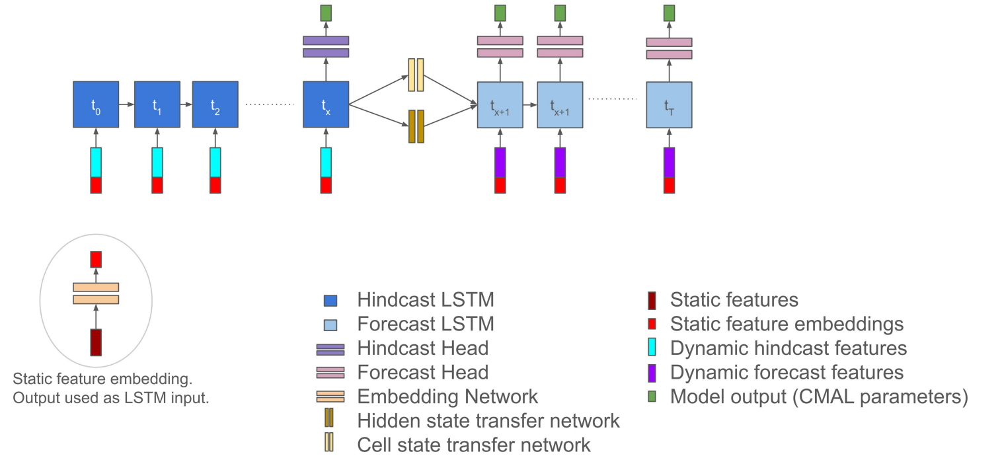
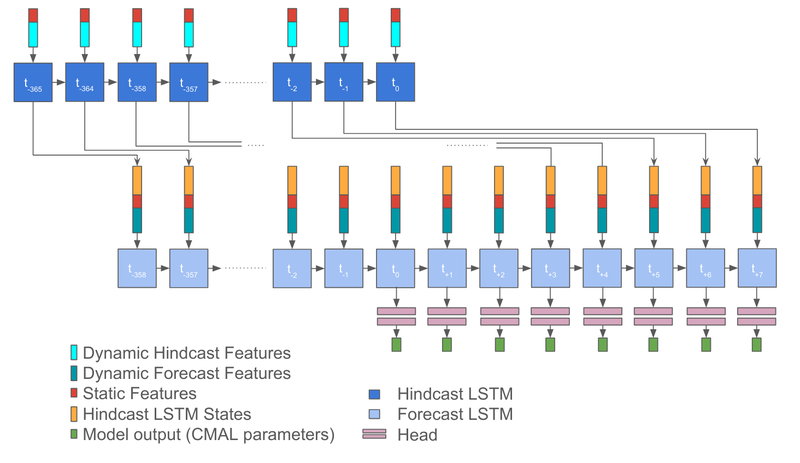

# LSTM4Flood  
Implement the PyTorch version of the model described in [Global prediction of extreme floods in ungauged watersheds](https://www.nature.com/articles/s41586-024-07145-1)
## Requirements
```
conda create --name <env> --file requirements.txt
conda activate <env>
```
## V1

## V2

## Reference
- https://research.google/blog/using-ai-to-expand-global-access-to-reliable-flood-forecasts/  
- https://www.nature.com/articles/s41586-024-07145-1
